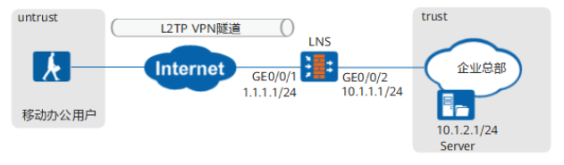

# CLI举例：配置Client-Initiated场景下的L2TP_VPN（本地认证）

Call-LNS场景下LAC和LNS之间建立一条永久的L2TP VPN隧道，分支机构员工直接通过L2TP VPN隧道即可访问总部服务器。  
分支机构的出口网关为LAC，公司总部的出口网关为LNS，分支机构的员工需要跨越Internet访问总部服务器。企业需要在LAC和LNS之间建立L2TP VPN隧道，实现分支机构员工通过L2TP VPN隧道访问总部服务器的需求。  

