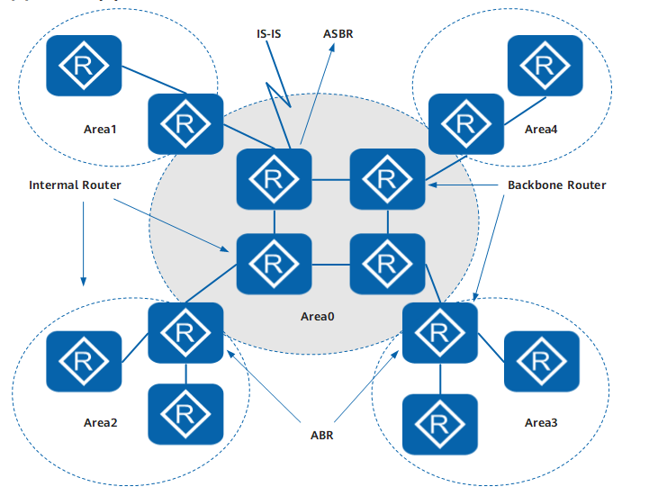
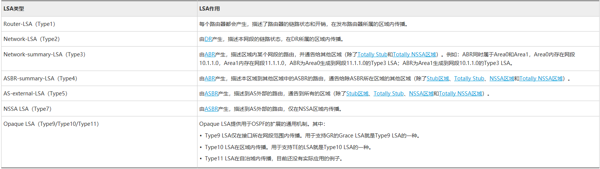
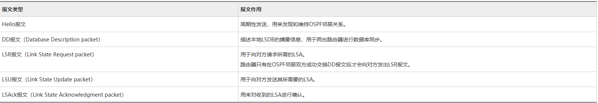
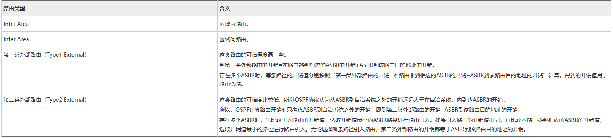
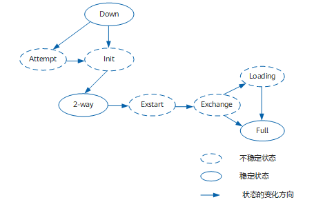
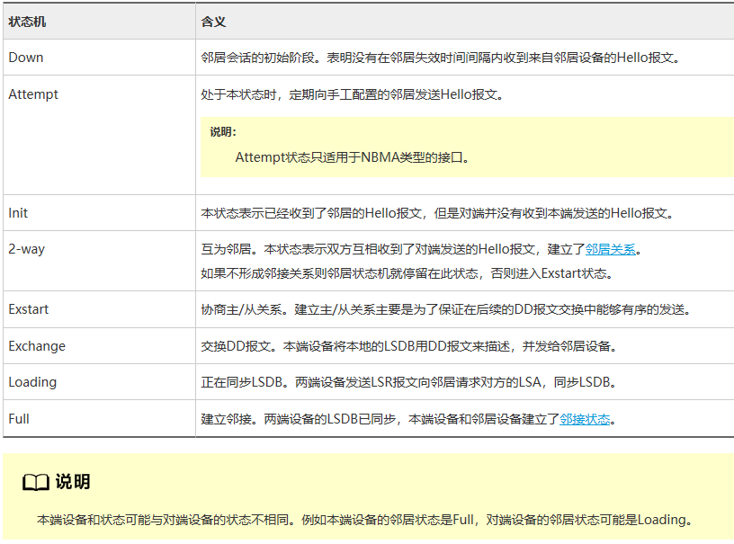
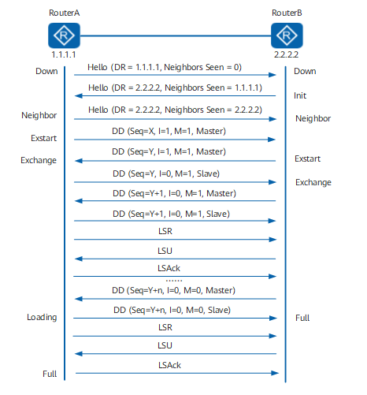

# OSPF  

OSPF（Open Shortest Path First）是IETF组织开发的一个基于链路状态的内部网关协议。目前针对IPv4协议使用的是OSPF Version 2（RFC2328）。OSPF是不属于任何一个厂商或组织私有的路由协议，使用Dijkstra的最短路径（SPF）算法计算路由。在OSPF中引入了区域的概念，有效的减少了路由选择协议对路由器CPU和内存的占用，同时也降低了路由选择协议的通信量，使得构建大型层次化网络成为可能。  

# OPF路由协议具有如下特性  

* 适应范围广——支持各种规模的网络，最多可支持几百台路由器。  
* 快速收敛——在网络的拓扑结构发生变化后立即发送更新报文，使这一变化在自治系统中同步。  
* 无自环——由于OSPF根据收集到的链路状态用最短路径树算法计算路由，从算法本身保证了不会生成自环路由。  
* 区域划分——允许自治系统的网络被划分成区域来管理，路由器的链路状态数据库仅需和所在区域的其他路由器保持一致。链路状态数据库的减小大大降低了对路由器内存的占用和CPU的消耗。同时，需要在区域间传送的路由信息的减小，降低了网络带宽的占用。  
* 路由分级——使用4类不同的路由，按优先顺序来说分别是：区域内路由、区域间路由、第一类外部路由、第二类外部路由。  
* 等价路由——支持到同一目的地址的多条等价路由。  
* 支持验证——支持基于区域和接口的报文验证，以保证报文交互的安全性。  
* 组播发送——在某些类型的链路上以组播地址发送协议报文，减少对其他设备的干扰。  

# Router ID  

Router ID是一个32比特无符号整数，是一台路由器在自治系统中的唯一标识。  

# 区域  

OSPF协议通过将自治系统划分成不同的区域解决链路状态数据库LSDB（Link-State Database）频繁更新的问题，提高网络的利用率。区域是从逻辑上将路由器划分为不同的组，每个组用区域号（Area ID）来标识。区域的边界是路由器，而不是链路。一个网段（链路）只能属于一个区域，或者说每个运行OSPF的接口必须指明属于哪一个区域。

## 骨干区域  

OSPF划分区域之后，并非所有的区域都是平等的关系。其中有一个区域其区域号（Area ID）是0，通常被称为骨干区域。骨干区域负责区域之间的路由，非骨干区域之间的路由信息必须通过骨干区域来转发。  

## 虚连接  

在实际应用中，可能会因为各方面条件的限制，无法满足所有非骨干区域与骨干区域保持连通的要求。这时可以通过配置OSPF虚连接（Virtual link）予以解决。  
虚连接是指在两台ABR之间通过一个非骨干区域而建立的一条逻辑上的连接通道。虚连接必须在两端同时配置方可生效。为虚连接两端提供一条非骨干区域内部路由的区域称为传输区域（Transit Area）。  

## Stub区域  

## NSSA区域  

# 路由器类型  

根据在自治系统AS中的不同位置，路由器可以分为以下几类。  

## 区域内路由器（Internal Router）  

该类路由器的所有接口都属于同一个OSPF区域。  

## 区域边界路由器ABR（Area Border Router）  

该类路由器可以同时属于两个以上的区域，但其中一个必须是骨干区域。  
ABR用来连接骨干区域和非骨干区域，它与骨干区域之间既可以是物理连接，也可以是逻辑上的连接。   

## 骨干路由器（Backbone Router）  

该类路由器至少有一个接口属于骨干区域。  
所有的ABR和位于Area0的内部路由器都是骨干路由器。  

## 自治系统边界路由器ASBR（AS Boundary Router）  

与其他AS交换路由信息的路由器称为ASBR。  
ASBR并不一定位于AS的边界，它可能是区域内路由器，也可能是ABR。只要一台OSPF路由器引入了外部路由的信息，它就成为ASBR。  

# LSA  

OSPF中对路由信息的描述都是封装在链路状态通告LSA（Link State Advertisement）中发布出去。  

# 报文类型  

OSPF用IP报文直接封装协议报文，协议号为89。OSPF分为5种报文：Hello报文、DD报文、LSR报文、LSU报文和LSAck报文。  

# 路由类型  

自治系统AS区域内和区域间路由描述的是AS内部的网络结构，AS外部路由则描述了应该如何选择到AS以外目的地址的路由。OSPF将引入的AS外部路由分为Type1和Type2两类。  

# OSPF支持的网络类型  

略

# DR和BDR  

通过选举产生DR（Designated Router）后，所有路由器都只将信息发送给DR，由DR将网络链路状态LSA广播出去。除DR和BDR之外的路由器（称为DR Other）之间将不再建立邻接关系，也不再交换任何路由信息，这样就减少了广播网和NBMA网络上各路由器之间邻接关系的数量。  

# OSPF多进程  

OSPF支持多进程，在同一台路由器上可以运行多个不同的OSPF进程，它们之间互不影响，彼此独立。不同OSPF进程之间的路由交互相当于不同路由协议之间的路由交互。路由器的一个接口只能属于某一个OSPF进程。  
OSPF多进程的一个典型应用就是在VPN场景中PE和CE之间运行OSPF协议，同时VPN骨干网上的IGP也采用OSPF。在PE上，这两个OSPF进程互不影响。  

# OSPF缺省路由  

略  

# OSPF邻居状态机  

# 在广播网络中建立OSPF邻接关系  

