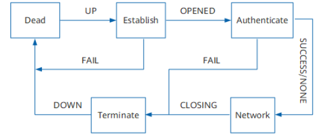
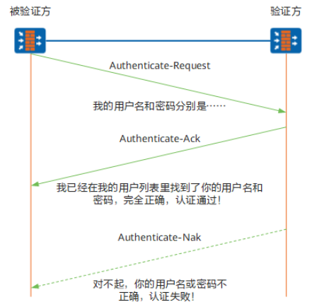
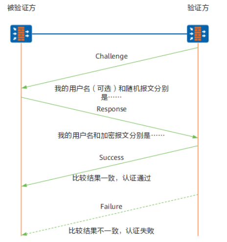
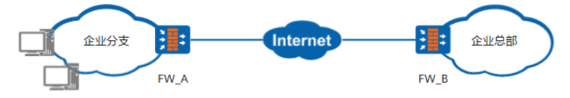

# PPP  

PPP协议是一种在点到点链路上传输、封装网络层数据包的数据链路层协议。  
PPP定义了一整套协议:  
* 链路控制协议LCP（Link Control Protocol）：主要用来建立、监控和拆除数据链路。   
* 网络层控制协议NCP（Network Control Protocol）：主要用来建立和配置不同的网络层协议，协商在数据链路上传输的数据包的格式与类型。  
* 验证协议PAP（Password Authentication Protocol）和CHAP（Challenge HandshakeAuthentication Protocol）：用于网络安全方面的验证。  

# PPP的运行过程  

1. 开始建立PPP链路时，先进入到Establish阶段。  
2. 在Establish阶段，PPP链路进行LCP协商。协商内容包括工作方式是SP（Single-link PPP）还是MP（Multilink PPP）、最大接收单元MRU、验证方式、魔术字（magic number）和异步字符映射等选项。LCP协商成功后进入Opened状态，表示底层链路已经建立。   
3. 如果配置了验证，将进入Authenticate阶段，开始CHAP或PAP验证。如果没有配置验证，则直接进入NCP协商阶段。  
4. 对于Authenticate阶段，如果验证失败，进入Terminate阶段，拆除链路，LCP状态转为Down。如果验证成功，进入NCP协商阶段，此时LCP状态仍为Opened，而NCP状态从Initial转到Starting。  
5. NCP协商支持IPCP、MPLSCP、OSCICP等协商。IPCP协商主要包括双方的IP地址。通过NCP协商来选择和配置一个网络层协议。只有相应的网络层协议协商成功后，该网络层协议才可以通过这条PPP链路发送报文。  
6. PPP链路将一直保持通信，直至有明确的LCP或NCP帧关闭这条链路，或发生了某些外部事件，例如用户干预。  

## PPP的PAP验证协议  

## PPP的CHAP验证协议  

# 通过PPP链路通信  

FW作为企业出口网关时，LAN侧连接内网主机，WAN侧连接运营商网络设备，根据WAN侧接口不同，运营商网络设备可能为DSLAM、OLT、无线基站。  

