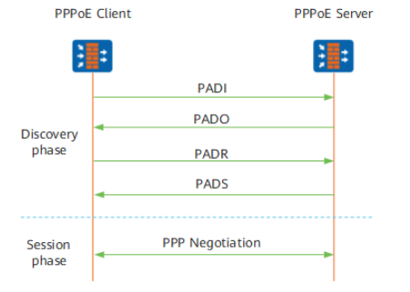

# PPPoE  

PPPoE提供了在以太网上建立PPPoE会话以及封装PPP数据包的方法。  
PPP（Point-to-Point）应用虽然很广泛，但是不能应用于以太网，因此提出了PPPoE技术。PPPoE是对PPP的扩展，它可以使PPP协议应用于以太网。  

# PPPoE连接建立过程  

PPPoE协议采用客户端-服务器（Client/Server）方式，它将PPP报文封装在以太网帧之内，在以太网上提供点对点的连接。  

## Discovery阶段  

当主机开始通过PPPoE接入服务器时，它必须先识别接入端的以太网MAC地址，建立PPPoE的Session_ID。这就是Discovery阶段的目的。  
Discovery阶段由四个过程组成。完成之后通信双方都会知道PPPoE的Session_ID以及对方以太网地址，它们共同确定了唯一的PPPoE会话。  

1. 主机在本以太网内广播一个PADI（PPPoE Active Discovery Initial）报文，在此报文中包含主机想要得到的服务类型信息。  
2. 以太网内的服务器收到这个PADI报文后，将其中请求的服务与自己能提供的服务进行比较，可以提供此服务的服务器发回PADO（PPPoE Active Discovery Offer）报文。  
3. 主机收到服务器的PADO报文，向它发回一个会话请求报文PADR（PPPoE Active Discovery Request）。  
4. 服务器产生一个唯一的会话标识，标识和主机的这段PPPoE会话。并把此会话标识通过会话确认报文PADS（PPPoE Active Discovery Session-confirmation）发回给主机，如果没有错误，双方进入PPPoE Session阶段。接入服务器发送确认数据包后，它就可以进入到PPPoE会话阶段。当主机接收到该确认数据包后，它就可以进入PPPoE会话阶段。  

## Session阶段  

当PPPoE进入Session阶段后，PPP报文就可以作为PPPoE帧的净荷封装在以太网帧发送到对端，Session_ID必须是Discovery阶段确定的ID，MAC地址必须是对端的MAC地址，PPP报文从Protocol ID开始。这时所有的以太网数据包都是单播的。  
在Session阶段，主机或服务器任何一方都可以发送PADT（PPPoE Active Discovery Terminate）报文通知对方结束本Session。  

