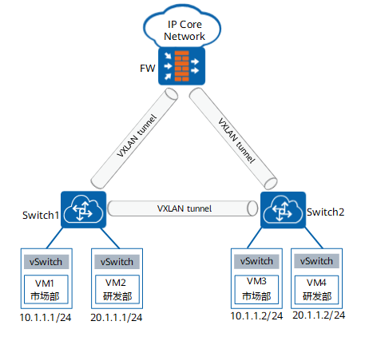
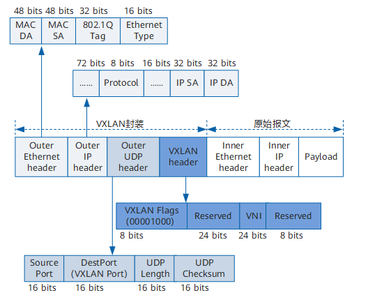
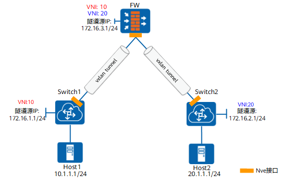

# VXLAN  

RFC7348定义了VXLAN扩展方案（Virtual eXtensible Local Area Network），采用MAC in UDP（User Datagram Protocol）封装方式，是NVO3（Network Virtualization over Layer 3）中的一种网络虚拟化技术。  
其目的是作为云计算的核心技术之一，服务器虚拟化凭借其大幅降低IT成本、提高业务部署灵活性、降低运维成本等优势已经得到越来越多的认可和部署。  

# 应用场景  

某大型企业的各业务部门位于该数据中心网络的不同位置。为了加强部门间的业务联系，企业需要相同业务部门（同网段）和不同业务部门（跨网段）间可以相互访问。例如，市场部的终端用户VM1和市场部的终端用户VM3可以相互访问，市场部的终端用户VM1和研发部的终端用户VM4间也可以互访。  
FW作为三层VXLAN网关，分别与Switch1和Switch2建立了VXLAN隧道，该VXLAN隧道用于转发不同业务部门间的访问流量。Switch1和Switch2作为二层VXLAN网关，两者之间的VXLAN隧道用于转发相同业务部门间的访问流量。  

# 基本概念  

虚拟机（VM）发出的二层报文经过VXLAN隧道进行UDP封装后，再通过三层物理网络发送到对端，VXLAN隧道实现了二层报文跨三层网络的转发。在VXLAN网络中，不同地域的企业用户可以自行规划自己的虚拟网络，不需要考虑物理网络IP地址和广播域的限制，降低了网络管理的难度。  

## VXLAN隧道  

VXLAN隧道用于将虚拟机（VM）发出的数据包封装在UDP中，并使用物理网络的IP、MAC作为outer-header进行封装，然后在IP网络上传输，到达目的地后由隧道终结点解封装并将数据发送给目标虚拟机。  

## NVE（Network Virtualization Edge）  

网络虚拟边缘节点，即提供VXLAN功能的设备。  

## VTEP（VXLAN Tunnel Endpoints）  

VTEP是VXLAN隧道端点。VXLAN报文中源IP地址为本节点的VTEP地址，VXLAN报文中目的IP地址为对端节点的VTEP地址，一对VTEP地址就对应着一个VXLAN隧道。  

## VNI（VXLAN Network Identifier）  

VXLAN网络标识VNI类似VLAN ID，用于区分VXLAN段，不同VXLAN段的虚拟机不能直接二层相互通信。  
一个VNI表示一个租户，即使多个终端用户属于同一个VNI，也表示一个租户。VNI由24比特组成，理论上支持多达16M的租户。  
VNI在VXLAN网络中是个全局概念，跨多个设备生效。  

## BD（Bridge-Domain）  

表示VXLAN网络的广播域。  
BD关联了VNI。在VXLAN的二层业务接入设备中，通过将VLAN绑定到BD，实现了从本地VLAN到全网VNI的映射关系。  
BD是个本地概念，即设备1中的BD1和设备2中的BD1没有任何关系。  

## BDIF（Bridge-Domain Interface）  

基于BD创建的三层逻辑接口。BDIF上配置的IP地址就是该VXLAN网络的网关地址。通过BDIF接口配置IP地址可实现不同网段的VXLAN间，及VXLAN和非VXLAN的通信。  

## 网关（Gateway）  

VXLAN网关用于实现VXLAN之间，以及VXLAN和非VXLAN之间能够进行相互通信。VXLAN网关按照所处的网络位置不同分为两类。  

* 二层网关：用于解决终端用户接入VXLAN虚拟网络的问题，也可用于同一VXLAN虚拟网络的子网通信。
* 三层网关：用于VXLAN虚拟网络的跨子网通信以及外部网络的访问。

# 报文格式  

VXLAN是MAC in UDP的网络虚拟化技术，所以其报文封装是在原始以太报文之前添加了一个UDP头及VXLAN头封装。  

# VXLAN隧道的工作原理  

## VXLAN隧道建立  

VXLAN隧道由管理员在VXLAN网关上手工指定隧道源IP地址、目的IP地址和VNI信息，只要隧道源IP地址和隧道目的IP地址之间路由可达，VXLAN隧道就可以建立成功。  
Switch1上指定了隧道源地址为172.16.1.1/24，目的地址为172.16.3.1/24，VNI为10的隧道信息，FW上同样指定VNI为10的隧道信息，两者间从而建立起VXLAN隧道。FW和Switch1之间通过该VXLAN隧道通信。同Switch1一样，Switch2也与FW建立了VXLAN隧道，VXLAN隧道的VNI为20。  

## MAC地址学习  

当Host1访问Host2时，由于是跨网段转发，因此Host1先要学习到三层VXLAN网关的MAC地址，学习过程如下。  

1. Host1发送ARP请求，寻找三层VXLAN网关地址。  
2. Switch1收到ARP请求时，会根据入接口Port1上的配置找到绑定的Bridge domain1，再根据Bridge domain找到VNI10。  
3. Switch1收到ARP请求后，更新VXLAN的MAC地址表，并将ARP请求通过VNI10对应的VXLAN隧道发往FW。  
4. FW收到ARP请求后，将VNI10对应的BDIF接口的MAC地址返回给Switch1。FW上有BDIF1和BDIF2两个接口，BDIF1接口对应VNI10，作为Host1的网关；BDIF2接口对应VNI20，作为Host2的网关。Host1和Host2之间的访问流量需要通过这两个逻辑接口进行转发。  
5. Switch1将BDIF1接口的MAC地址返回给Host1。  

自此，Host1学习到了三层VXLAN网关BDIF1接口的MAC地址。Host2学习BDIF2接口MAC地址的过程与此相同，此处不再赘述。  

## 报文转发  

Host1学习到三层VXLAN网关的MAC地址以后，正式进行业务访问，报文的转发过程如下。  

1. Host1将业务报文发送Switch1。  
2. Switch1根据入接口Port1上的配置找到绑定的Bridge domain1，再根据Bridge domain找到VNI10，然后将报文通过VNI10对应VXLAN隧道发送给FW。  
3. FW首先将报文进行解封装，然后再根据到Host2的路由将报文从VNI20对应的VXLAN隧道发往Host2。  
4. Switch2根据MAC地址表将报文发往Host2。  

