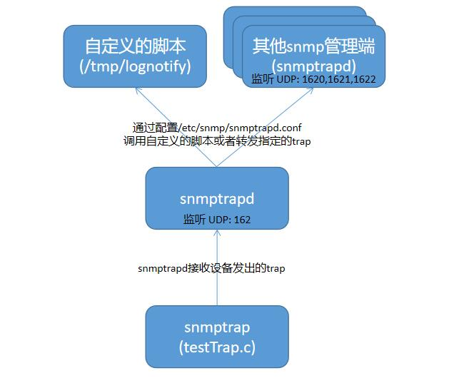

# SNMPTRAP  

## 测试模型  

snmptrapd接收网络设备发出的trap,调用自定义的脚本处理trap或者转发trap  

  

## 资料参考  

* [snmptrapd配置](http://www.net-snmp.org/wiki/index.php/TUT:Configuring_snmptrapd)
* [功能操作](http://www.net-snmp.org/wiki/index.php/TUT:SNMP)
* [TRAP功能](https://blog.csdn.net/huntinux/article/details/80527190)  

## 环境安装  

测试环境为ubuntu 1804，并切换到root用户  

*root@plus:~/C# uname -a  
Linux plus 4.15.0-55-generic #60-Ubuntu SMP Tue Jul 2 18:22:20 UTC 2019 x86_64 x86_64 x86_64 GNU/Linux*  

安装组件  

```
apt-get update 
apt install snmp snmp-mibs-downloader snmptrapd libsnmp-dev
```  

## 配置修改  

```
mkdir -p /etc/snmp
mkdir -p ~/.snmp/mibs
_modifyTime=`date +"%Y%m%d_%H%M%S"`
#添加自定义mib
cat > ~/.snmp/mibs/IBM-DW-SAMPLE.mib << eof
IBM-DW-SAMPLE DEFINITIONS ::= BEGIN
IMPORTS
MODULE-IDENTITY, OBJECT-TYPE, TimeTicks FROM SNMPv2-SMI
DisplayString, FROM SNMPv2-TC
enterprises
FROM RFC1155-SMI;
test OBJECT IDENTIFIER ::= { enterprises 1000 }
TestTraps OBJECT IDENTIFIER ::= { test 1 }
nodeDown NOTIFICATION-TYPE
STATUS current
DESCRIPTION "node down notification"
::= { TestTraps 1 }
nodeDownTest0 OBJECT IDENTIFIER ::= { nodeDown 0 }
nodeDownTest1 OBJECT IDENTIFIER ::= { nodeDown 1 }
END
eof
#修改snmp配置
cp /etc/snmp/snmp.conf /etc/snmp/snmp.conf.backup.$_modifyTime
echo mibs +/root/.snmp/mibs/IBM-DW-SAMPLE.mib > /etc/snmp/snmp.conf
#修改snmptrapd配置，增加对自定义类型PDU的处理 （指定由脚本/tmp/lognotify进行处理）
cp /etc/snmp/snmptrapd.conf /etc/snmp/snmptrapd.conf.backup.$_modifyTime
echo traphandle default /tmp/lognotify IBM-DW-SAMPLE::nodeDown > /etc/snmp/snmptrapd.conf
echo authCommunity log,execute,net public >> /etc/snmp/snmptrapd.conf
#服务重启
systemctl restart snmpd
```  

## 例子  

### 测试TRAP功能是否能正常使用  

创建处理脚本 /tmp/lognotify后启动snmptrapd  

```
cat > /tmp/lognotify <<eof
#!/bin/sh
read host
read ip
vars=
while read oid val
do
if [ "\$vars" = "" ]
then
vars="\$oid = \$val"
else
vars="\$vars, \$oid = \$val"
fi
done
echo trap: \$1 >/tmp/checkfile
echo host: \$host >>/tmp/checkfile
echo ip: \$ip >>/tmp/checkfile
echo vars: \$vars >>/tmp/checkfile
eof
chmod 777 /tmp/lognotify
snmptrapd -f -d -c /etc/snmp/snmptrapd.conf -Lo
```  

新建会话确认PDU类型的编号  

*root@plus:~/snmp# snmptranslate IBM-DW-SAMPLE::nodeDown -On  
.1.3.6.1.4.1.1000.1.1*
*root@plus:~/snmp# snmptranslate IBM-DW-SAMPLE::nodeDownTest0 -On  
.1.3.6.1.4.1.1000.1.1.0*
*root@plus:~/snmp# snmptranslate IBM-DW-SAMPLE::nodeDownTest1 -On  
.1.3.6.1.4.1.1000.1.1.1*  

#### snmpv2c

创建snmpv2c版测试程序  

```
cat > testTrapV2c.c << eof
#include <net-snmp/net-snmp-config.h>
#include <net-snmp/net-snmp-includes.h>
#include <stdio.h>
#include <stdlib.h>
#include <string.h>
int main(void)
{
char peername[256],commu[256];
init_snmp("myexample");
struct snmp_session session;
snmp_sess_init(&session);
session.version = SNMP_VERSION_2c;
strcpy(peername,"127.0.0.1:162");
strcpy(commu,"public");
session.peername = peername;
session.community = (unsigned char*)commu;
session.community_len = strlen(commu);
netsnmp_session *ss = snmp_open(&session);
oid objid_sysuptime[] = { 1, 3, 6, 1, 2, 1, 1, 3, 0 };
oid objid_snmptrap[] = { 1, 3, 6, 1, 6, 3, 1, 1, 4, 1, 0 };
oid objid_test[] = { 1, 3, 6, 1, 4, 1, 1000, 1, 1, 0 };//Test0:1.3.6.1.4.1.1000.1.1.0 Test1:1.3.6.1.4.1.1000.1.1.1
netsnmp_pdu * pdu = NULL;
in_addr_t addr;
pdu = snmp_pdu_create(SNMP_MSG_TRAP2);
long sysuptime = 0;
char tempbuf[128];
memset(tempbuf,0 ,sizeof(tempbuf));
sysuptime = get_uptime();
sprintf(tempbuf,"%ld",sysuptime);
snmp_add_var(pdu, objid_sysuptime, sizeof(objid_sysuptime)/sizeof(oid), 't', tempbuf);
snmp_add_var(pdu, objid_snmptrap, sizeof(objid_snmptrap)/sizeof(oid),'o',"IBM-DW-SAMPLE::nodeDown");
snmp_add_var(pdu, objid_test, sizeof(objid_test)/sizeof(oid),'s',"test0..... successfully");
size_t tmpOID_len = 10;
oid tmpOID[10];
snmp_parse_oid("IBM-DW-SAMPLE::nodeDownTest1", tmpOID, &tmpOID_len);
snmp_add_var(pdu, tmpOID, sizeof(tmpOID)/sizeof(oid),'s',"test1..... successfully");
if( !snmp_send(ss, pdu) )
{
printf("Send pdu error \n");
}
snmp_close(ss);
snmp_shutdown( "myexample" );
SOCK_CLEANUP;
return 0;
}
eof
gcc testTrapV2c.c -lnetsnmp && ./a.out
cat /tmp/checkfile
```  

输出结果  

*root@plus:~# cat /tmp/checkfile  
trap: IBM-DW-SAMPLE::nodeDown  
host: localhost.localdomain  
ip: UDP: [127.0.0.1]:56931->[127.0.0.1]:162  
vars: DISMAN-EVENT-MIB::sysUpTimeInstance = 0:2:00:14.98, SNMPv2-MIB::snmpTrapOID.0 = SNMPv2-SMI::enterprises.1000.1.1, SNMPv2-SMI::enterprises.1000.1.1.0 = "test0..... successfully", SNMPv2-SMI::enterprises.1000.1.1.1 = "test1..... successfully"*    

#### snmpv3  

创建snmpv3版测试程序  

```
cat > testTrapV3.c << eof
#include <net-snmp/net-snmp-config.h>
#include <net-snmp/net-snmp-includes.h>
#include <stdio.h>
#include <stdlib.h>
#include <string.h>
int main(void)
{
char peername[256],commu[256];
init_snmp("myexample");
struct snmp_session session;
snmp_sess_init(&session);
session.version = SNMP_VERSION_2c;
strcpy(peername,"127.0.0.1:162");
strcpy(commu,"public");
session.peername = peername;
session.community = (unsigned char*)commu;
session.community_len = strlen(commu);
netsnmp_session *ss = snmp_open(&session);
oid objid_sysuptime[] = { 1, 3, 6, 1, 2, 1, 1, 3, 0 };
oid objid_snmptrap[] = { 1, 3, 6, 1, 6, 3, 1, 1, 4, 1, 0 };
oid objid_test[] = { 1, 3, 6, 1, 4, 1, 1000, 1, 1, 0 };//Test0:1.3.6.1.4.1.1000.1.1.0 Test1:1.3.6.1.4.1.1000.1.1.1
netsnmp_pdu * pdu = NULL;
in_addr_t addr;
pdu = snmp_pdu_create(SNMP_MSG_TRAP2);
long sysuptime = 0;
char tempbuf[128];
memset(tempbuf,0 ,sizeof(tempbuf));
sysuptime = get_uptime();
sprintf(tempbuf,"%ld",sysuptime);
snmp_add_var(pdu, objid_sysuptime, sizeof(objid_sysuptime)/sizeof(oid), 't', tempbuf);
snmp_add_var(pdu, objid_snmptrap, sizeof(objid_snmptrap)/sizeof(oid),'o',"IBM-DW-SAMPLE::nodeDown");
snmp_add_var(pdu, objid_test, sizeof(objid_test)/sizeof(oid),'s',"test0..... successfully");
size_t tmpOID_len = 10;
oid tmpOID[10];
snmp_parse_oid("IBM-DW-SAMPLE::nodeDownTest1", tmpOID, &tmpOID_len);
snmp_add_var(pdu, tmpOID, sizeof(tmpOID)/sizeof(oid),'s',"test1..... successfully");
if( !snmp_send(ss, pdu) )
{
printf("Send pdu error \n");
}
snmp_close(ss);
snmp_shutdown( "myexample" );
SOCK_CLEANUP;
return 0;
}
eof
gcc testTrapV3.c -lnetsnmp && ./a.out
cat /tmp/checkfile
```  

输出结果  

*root@plus:~# cat /tmp/checkfile  
trap: IBM-DW-SAMPLE::nodeDown  
host: localhost.localdomain  
ip: UDP: [127.0.0.1]:56931->[127.0.0.1]:162  
vars: DISMAN-EVENT-MIB::sysUpTimeInstance = 2:14:33:00.14, SNMPv2-MIB::snmpTrapOID.0 = SNMPv2-SMI::enterprises.1000.1.1, SNMPv2-SMI::enterprises.1000.1.1.0 = "test0..... successfully", SNMPv2-SMI::enterprises.1000.1.1.1 = "test1..... successfully"* 

### 测试TRAP是否能正常转发  

添加转发规则到配置文件中，重新运行snmptrapd  

```
cat > /etc/snmp/snmptrapd.conf << eof
traphandle default /tmp/lognotify IBM-DW-SAMPLE::nodeDown
authCommunity log,execute,net public
forward default localhost:1620
forward default localhost:1621
forward default localhost:1622
eof
snmptrapd -f -d -c /etc/snmp/snmptrapd.conf -Lo
```  

另外新建三个窗口运行新的snmptrapd并且不指定配置文件(用/etc/snmp/snmptrapd.conf会造成无穷无尽的转发)，分别监听1620、1621、1622端口  

```
snmptrapd -f -d -Lo 1620
```  

```
snmptrapd -f -d -Lo 1621
```  

```
snmptrapd -f -d -Lo 1622
```  

新建窗口执行测试程序  

```
gcc testTrap.c -lnetsnmp && ./a.out
```  

可观察到每个窗口下的程序都能接收snmptrap报文  

### 测试INFORM功能是否能正常使用  

与TRAP功能类似，将代码中SNMP_MSG_TRAP2改为SNMP_MSG_INFORM再编译运行，snmptrapd接收到消息会进行反馈。  


