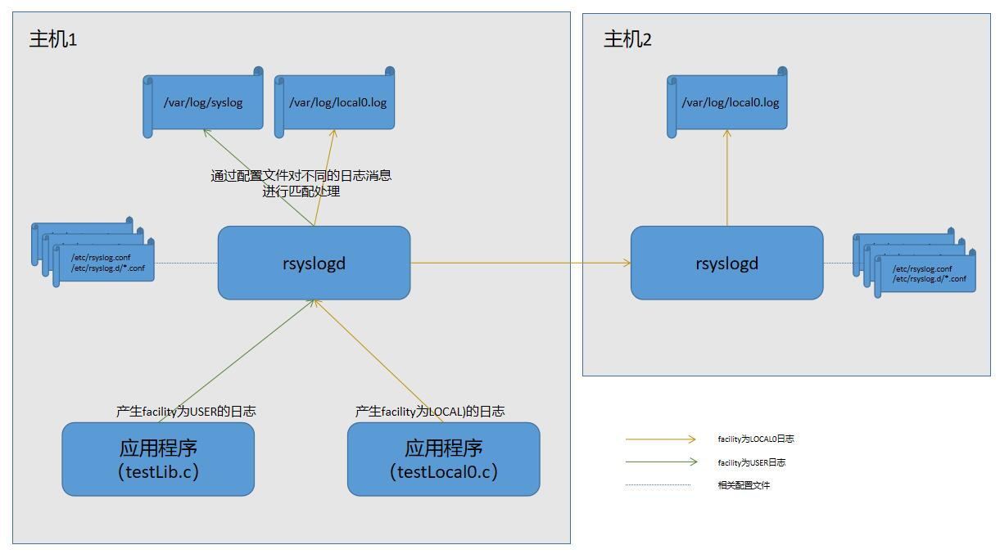

# syslog  

## 测试模型  

rsyslogd收集测试程序生成的日志，根据配置文件里的规则记录到特定文件中或者转发到另一台主机上的rsyslogd  
  

## 资料参考  

* [rsyslogd配置](https://www.rsyslog.com/doc/v8-stable/configuration/index.html)  
* [syslog协议](https://tools.ietf.org/html/rfc5424)  
* [syslog.h](http://www.man7.org/linux/man-pages/man3/syslog.3.html)  

## 环境安装  

测试环境为两台ubuntu 1804，并切换到root用户  

*root@plus:~/log4c# uname -a  
Linux plus 4.15.0-55-generic #60-Ubuntu SMP Tue Jul 2 18:22:20 UTC 2019 x86_64 x86_64 x86_64 GNU/Linux*   

## 配置修改  
### 主机1  

在主机1上增加对日志数据facility为local0日志的处理，记录到/var/log/local0.log并且转发到主机2(主机2ip地址为192.168.2.191)  

```
cat > /etc/rsyslog.d/99-local0.conf << eof
local0.*       /var/log/local0.log
local0.*       @192.168.2.191
eof
systemctl stop rsyslog
systemctl start rsyslog
```  

### 主机2  

在主机2上打开rsyslogd的UDP syslog接收功能，并开放514端口，将日志数据facility为local0日志记录到/var/log/local0.log  

```
cat > /etc/rsyslog.d/99-local0.conf << eof
\$ModLoad imudp
\$UDPServerRun 514
local0.*       /var/log/local0.log
eof
systemctl stop rsyslog
systemctl start rsyslog
iptables -I INPUT -p UDP --dport 514 -j ACCEPT
```  

## 例子  

### 测试lib库是否能正常使用  

```
cat > testLib.c <<eof
#include <syslog.h>
#include <stdio.h>
#include <stdarg.h>
int main(void){
 openlog(NULL, LOG_PID|LOG_CONS, LOG_USER);
 syslog(LOG_INFO, "...syslog info test \n");
 syslog(LOG_DEBUG,"...syslog debug test\n");
 closelog();
}
eof
> /var/log/syslog
gcc testLib.c && ./a.out
grep '...syslog' /var/log/syslog

```  

输出结果  

*root@plus:~/syslog# > /var/log/syslog*  
*root@plus:~/syslog# gcc testLib.c && ./a.out*  
*root@plus:~/syslog# grep '...syslog' /var/log/syslog*  
*2019-08-08T07:17:24.785636+00:00 localhost a.out[25739]: ...syslog info test*  
*2019-08-08T07:17:24.786072+00:00 localhost a.out[25739]: ...syslog debug test*  

### 测试指定facility为local0并转发  

```
cat > testLocal0.c <<eof
#include <syslog.h>
#include <stdio.h>
#include <stdarg.h>
int main(void){
 openlog(NULL, LOG_PID|LOG_CONS, LOG_LOCAL0);
 syslog(LOG_INFO, "...syslog info test \n");
 syslog(LOG_DEBUG,"...syslog debug test\n");
 closelog();
}
eof
> /var/log/local0.log
gcc testLocal0.c && ./a.out
grep '...syslog' /var/log/local0.log

```  

输出结果（主机1）  

*root@plus:~/syslog# > /var/log/local0.log*  
*root@plus:~/syslog# gcc testLocal0.c && ./a.out*  
*root@plus:~/syslog# grep '...syslog' /var/log/local0.log*  
*2019-08-08T07:27:27.531511+00:00 localhost a.out[25947]: ...syslog info test*  
*2019-08-08T07:27:27.532056+00:00 localhost a.out[25947]: ...syslog debug test*  

输出结果（主机2）  

*[root@localhost ~]# grep '...syslog' /var/log/local0.log*  
*Aug  8 07:28:05 localhost a.out[25963]: ...syslog info test*  
*Aug  8 07:28:05 localhost a.out[25963]: ...syslog debug test*  
