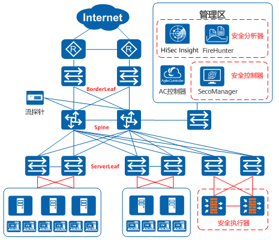
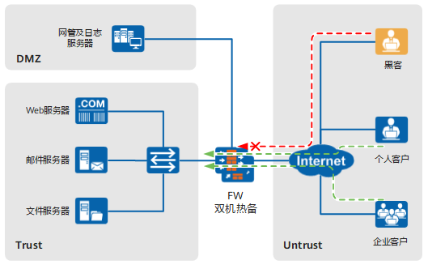
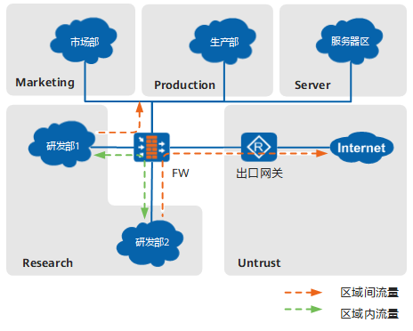
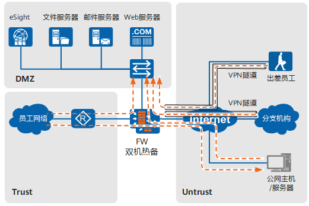
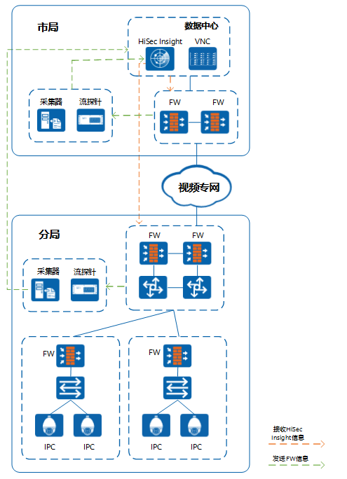

# 应用场景   

## 大中型企业边界防护   

大中型企业通常员工人数众多、业务复杂，极易成为各类网络威胁的攻击目标。因此需要边界设备具备强大的威胁检测与防御能力，能够在持续大流量环境下稳定运行。USG6000E系列防火墙可以作为大中型企业的出口网关，对企业的网络边界进行安全防护。  

## 内网管控与安全隔离   

大中型企业的内网构成往往比较复杂，因此需要对内部不同业务网络进行安全等级划分和安全隔离，并对不同网络间交互的流量进行实时监控。同时，通过建立用户管理体系，对内网主机接入用户进行权限控制、配额控制以及带宽资源管理。USG6000E系列防火墙可以作为大中型企业的内网边界，实现内网管控与安全隔离，有效避免潜在风险。  

## 传统数据中心边界防护   

数据中心的核心功能是对外提供网络服务，因此保证外网对数据中心服务器的正常访问极其重要。这不仅要求边界防护设备拥有强大的处理性能、合理的流量管理机制以及完善的可靠性机制，还需要其具备抵御外部网络安全威胁的能力，并能在受到网络攻击时仍然保证业务持续无间断的运行。USG6000E系列防火墙可以作为数据中心的边界网关，对数据中心内的服务器进行保护。  

## 云数据中心安全联动   

在云化数据中心中，安全设备需要适应云的弹性扩缩、快速上线、自助服务等特点，同时还要应对网络边界模糊、安全威胁升级等挑战。USG6000E系列防火墙可以作为云化数据中心网络中的安全执行器采集网络中的流量，并与安全分析器和安全控制器联动进行基于大数据的安全检测和智能分析，生成对应的安全策略执行安全功能。满足云数据中心边界、租户边界和租户内网的安全防护需求。  

## 视频监控网络入侵防御   

在视频监控网络中，受摄像头部署位置复杂、视频监控全网互联趋势等影响，视频监控网络正面临着极大的安全威胁风险。USG6000E系列防火墙可以对视频监控网络的入网终端进行接入控制，防止非视频应用、非授权厂商IPC接入；通过IPS签名拦截被感染的 摄像头，防止摄像头将病毒带入视频监控网络中；同时还支持与HiSec Insight（原CIS）联动，接收HiSec Insight下发的联动策略，有效检测并阻断网络中受感染的终端。 

