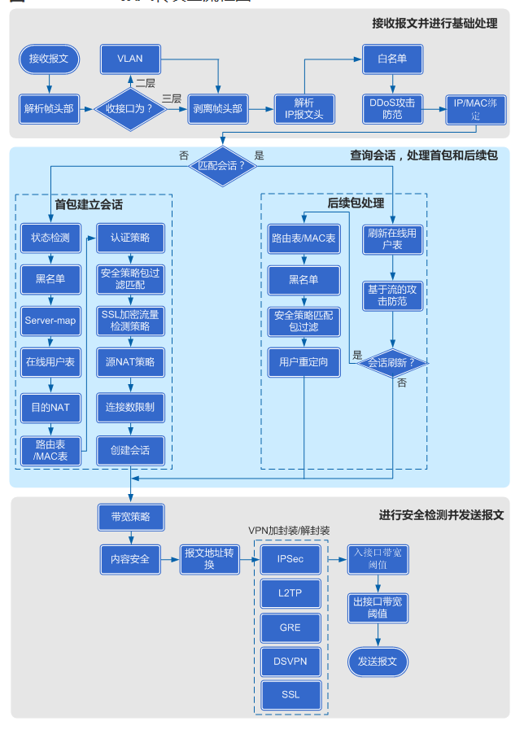
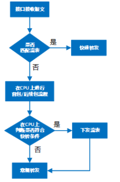
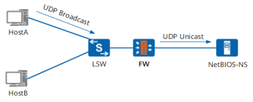

# 报文转发全流程

展示了各个模块的基本处理顺序。实际每一个报文的处理并非严格按照此流程图依次进行。  

## 接收报文，对报文进行基本处理  

这个阶段的主要目的是解析出报文的帧头部和IP报文头部。  

## 查询会话表，对首包和后续包做不同处理  

这个阶段是FW的核心处理环节，主要包括会话建立、会话刷新等过程。  

## 对报文进行安全检测，发送报文  

这个阶段的主要目的是对流量进行持续的安全防护，同时保证报文被正确发送。  

# 硬件快转  

通常情况下，FW接收到报文后，上送CPU处理，CPU处理完成后送往指定出接口。  
为了减轻CPU负担，同时提高设备业务处理性能，FW支持对某些业务进行快速转发，对于符合快转条件的后续报文，通过加速硬件进行快速转发，不上送CPU处理。  

# 状态检测  

FW通过状态检测功能来对报文的链路状态进行合法性检查，丢弃链路状态不合法的报文。状态检测功能不仅检测普通报文，也对内层报文（VPN报文解封装后的报文）进行检测。  
当FW作为网络的唯一出口时，所有报文都必须经过FW转发。在这种情况下，一次通信过程中来回两个方向的报文都能经过FW的处理，这种组网环境也称为报文来回路径一致的组网环境。此时就可以在FW上开启状态检测功能，保证业务安全。  
但是在报文来回路径不一致的组网环境中，FW可能只会收到通信过程中的后续报文，而没有收到首包，在这种情况下，为了保证业务正常，就需要关闭FW的状态检测功能。当关闭状态检测功能后，FW可以通过后续报文建立会话，保证业务的正常运行。   

# 会话表  

会话表是用来记录TCP、UDP、ICMP等协议连接状态的表项，是FW转发报文的重要依据。  

# Server-map表  

通常情况下，如果在设备上配置严格的安全策略，那么设备将只允许内网用户单方向主动访问外网。但在实际应用中，例如使用FTP协议的port方式传输文件时，既需要客户端主动向服务器端发起控制连接，又需要服务器端主动向客户端发起服务器数据连接，如果设备上配置的安全策略为允许单方向上报文主动通过，则FTP文件传输不能成功。  
为了解决这一类问题，FW引入了Server-map表，Server-map用于存放一种映射关系，这种映射关系可以是控制数据协商出来的数据连接关系，也可以是配置NAT中的地址映射关系，使得外部网络能透过设备主动访问内部网络。  
生成Server-map表之后，如果一个数据连接匹配了Server-map表项，那么就能够被设备正常转发，并在匹配Server-map表后创建会话，保证后续报文能够按照会话表转发。  

# IP性能  

略  

# UDP Helper  

网络中的主机有时需要向服务器发送UDP广播报文，用以获取网络配置或解析网络主机名等。但是，如果主机和服务器不在同一个广播域时，无法利用UDP广播报文进行通信，主机就无法从服务器获取所需要的信息。  
为解决上述问题，FW提供了UDP Helper功能。通过该功能可以对目的端口为指定端口的UDP广播报文进行中继转发，将广播报文转换为单播报文发送给指定的目的服务器。  

